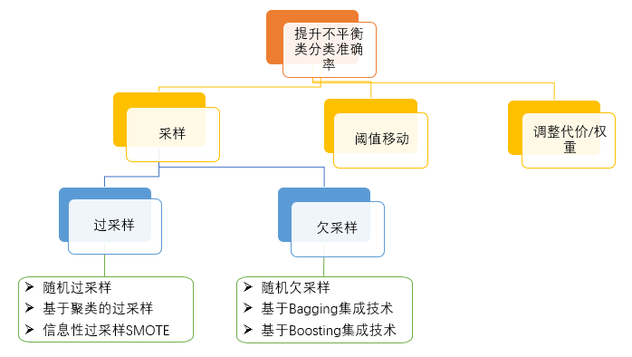
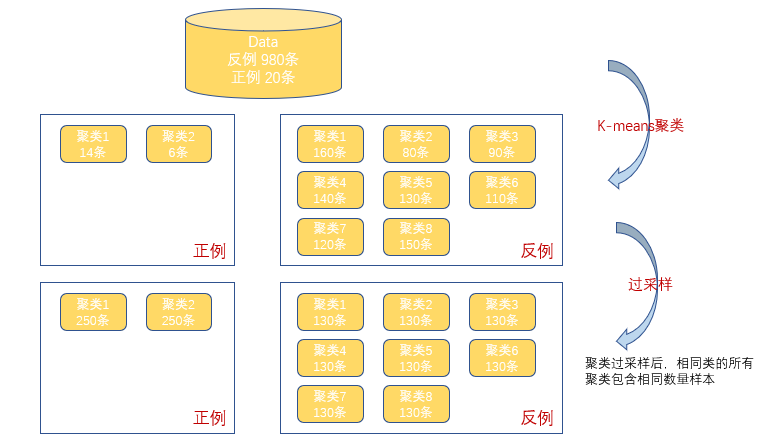
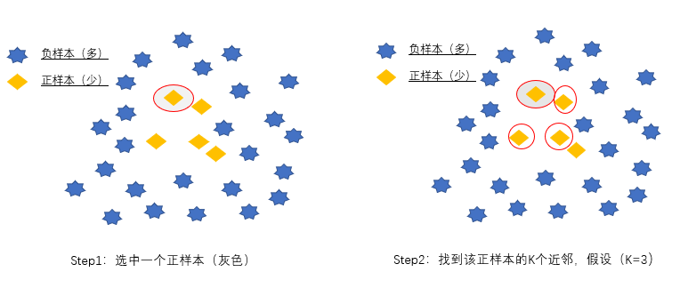
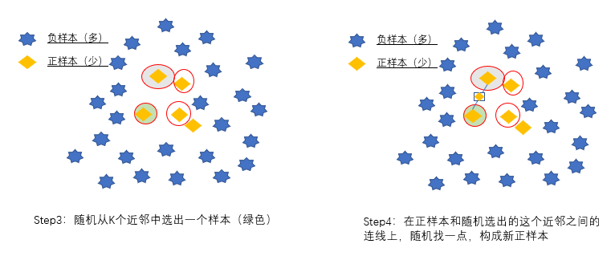
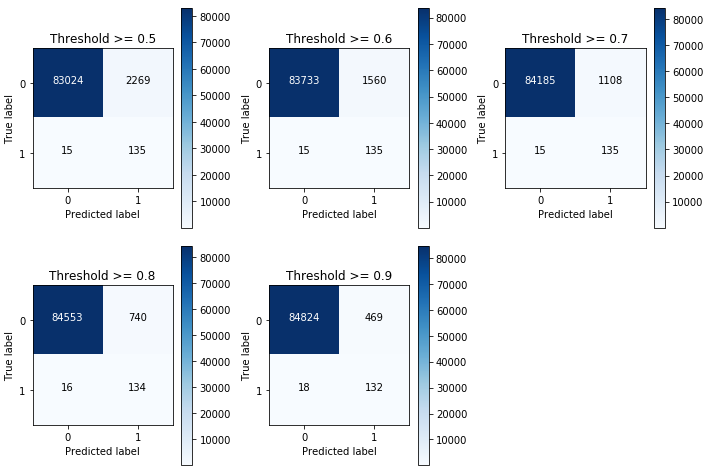
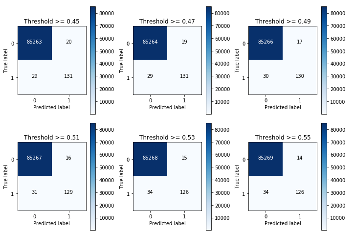

# 分类类别不平衡问题--python篇 #
## 一、什么是类不平衡 ##
在分类中经常会遇到：某些类别数据特别多，某类或者几类数据特别少。如二分类中，一种类别（反例）数据特别多，另一种类别（正例）数据少的可怜。如银行欺诈问题，客户流失问题，电力盗窃以及罕见疾病识别等都存在着数据类别不均衡的情况。
## 二、为什么要对类不平衡进行特殊处理 ##
传统的分类算法旨在最小化分类过程中产生的错误数量。它们假设假阳性（实际是反例，但是错分成正例）和假阴性（实际是正例，但是错分为反例）错误的成本是相等的，因此不适合于类不平衡的数据。

有研究表明，在某些应用下，1∶35的比例就会使某些分类方法无效，甚至1∶10的比例也会使某些分类方法无效。如果数据存在严重的不平衡，预测得出的结论往往也是有偏的，即分类结果会偏向于较多观测的类。
## 三、提升不平衡类分类准确率的方法 ##
提升不平衡类分类准确率的方法有三大类：采样、阈值移动、调整代价或权重。

### 1、采样 ###
#### 1.1 过采样 ####
过采样基本思想就是通过改变训练数据的分布来消除或减小数据的不平衡。过采样有随机过采样、基于聚类的过采样、信息性过采样（SMOTE）三大类方法。
**随机过采样**：通过增加少数类样本来提高少数类的分类性能 ，最简单的办法是随机复制少数类样本。

**基于聚类的过采样**：K-Means聚类算法独立地被用于少数和多数类实例，之后，每个聚类都过采样使得相同类的所有聚类有着同样的实例数量。

**信息性过采样--SMOTE **
利用KNN技术，对于少数类样本a, 随机选择一个最近邻的样本b, 然后从a与b的连线上随机选取一个点c作为新的少数类样本。

SMOTE有时能提升分类准确率，有时不能，甚至可能因为构建数据时放大了噪声数据导致分类结果变差，这要视具体情况而定。

#### 1.2 欠采样 ####
欠采样方法通过减少多数类样本来提高少数类的分类性能。
**随机欠采样**：通过随机地去掉一些多数类样本来减小多数类的规模。

**集成技术**：欠采样中的算法集成技术是利用集成学习机制，将反例划分为若干个集合供不同学习器使用，这样对每个学习器来看都进行了欠采样，但在全局来看却不会丢失重要信息，一般适用于数据集足够大的情况。这里的集成技术可以分为基于Bagging的方法和基于Boosting的方法。

### 2、 阈值移动法 ###
许多模型的输出类别是基于阈值的，例如逻辑回归中小于0.5的为反例，大于则为正例。在数据不平衡时，默认的阈值会导致模型输出倾向于类别数据多的类别。阈值移动是通过改变决策阈值来偏重少数类。

### 3 、调整代价或权重法 ###
通过调整不同类类的代价或权重来偏重少数类以改进分类性能。
## 四、方法评价 ##
方法|优点|缺点
--|--|--
随机过采样| 不会造成信息缺失，表现优于欠采样|过采样会引起噪声数据的权重过大，也会加大过拟合的可能性
基于聚类的过采样|有助于克服类之间不平衡，有助于克服由不同子聚类组成的类之间的不平衡|可能造成过拟合
信息性过采样SMOTE|缓解过拟合，不会损失有价值信息|对高维数据不是很有效；当生成合成性实例时，不会把来自其他类的相邻实例考虑进来，这会导致类重叠的增加，引入额外的噪音
随机欠采样|减少运行时间，并且当数据集很大时，可以通过减少样本数量来解决存储问题|可能会丢失重要信息，采样后的数据不一定能代表全部数据，导致分类结果不精准
集成技术|不会造成信息缺失|运行耗时，占内存，要求数据集足量大
阈值移动|不会造成信息缺失，过拟合的可能性小|很难建立参数与不平衡分类精度间的定量关系，不能准确处理不平衡数据
调整代价或权重|不会造成信息缺失，过拟合的可能性小|很难建立参数与不平衡分类精度间的定量关系，不能准确处理不平衡数据

## 五、实际案例 ##
###### 案例：信用卡欺诈 ######
案列介绍：数据集由欧洲持卡人于2013年9月使用信用卡进行交易的数据。此数据集显示两天内发生的交易，其中284,807笔交易中有492笔被盗刷。数据集非常不平衡，被盗刷占所有交易的0.172％。

由于保密问题，数据只包含作为PCA转换结果的数字输入变量V1，V2，... V28，没有用PCA转换的唯一特征是“时间”和“量”。特征'时间'包含数据集中每个事务和第一个事务之间经过的秒数，特征“金额”是交易金额，特征'类'是响应变量，如果发生被盗刷，则取值1，否则为0。

尝试了多种方法，以此数据案例结果来看，法二XGboost模型比较好，当然最优结果不止局限于此，大家可以尝试其它方法优化结果

**数据下载**

链接：https://pan.baidu.com/s/1QBNjspcGfKfML3h8KpFNvA 

提取码：wvrc 

**法一：SMOTE算法、LR模型以及阈值移动的方法**

参见代码--credictcard_smote_LR_threshold.py

混淆矩阵如下所示

**法二：算法集成技术XGBoost**

参见代码--creditcard_xgboost_threshold.py

混淆矩阵如下所示

**期间安装imblearn包出现的小插曲：**

conda和pip都报错，将安装语句改为：conda install -c glemaitre imbalanced-learn 安装 成功

**参考资料：**

https://github.com/wangjiang0624/Note/blob/master/MachineLearning/分类类别不平衡.md

https://www.jiqizhixin.com/articles/2017-03-20-8

https://www.kaggle.com/mlg-ulb/creditcardfraud
